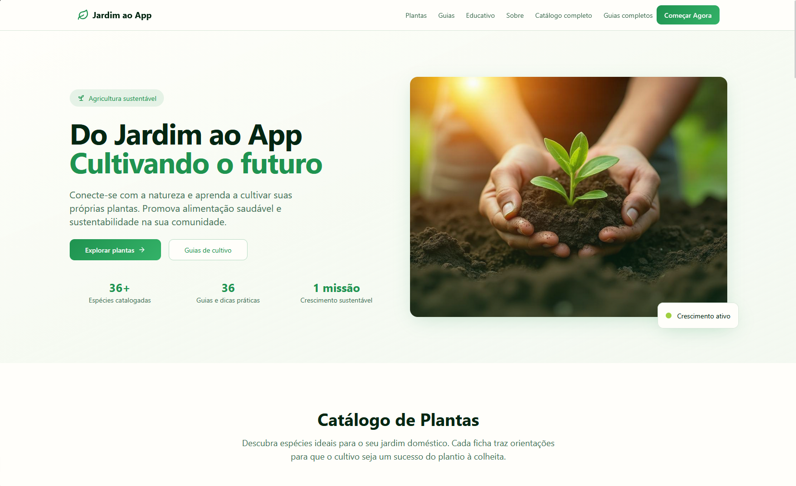
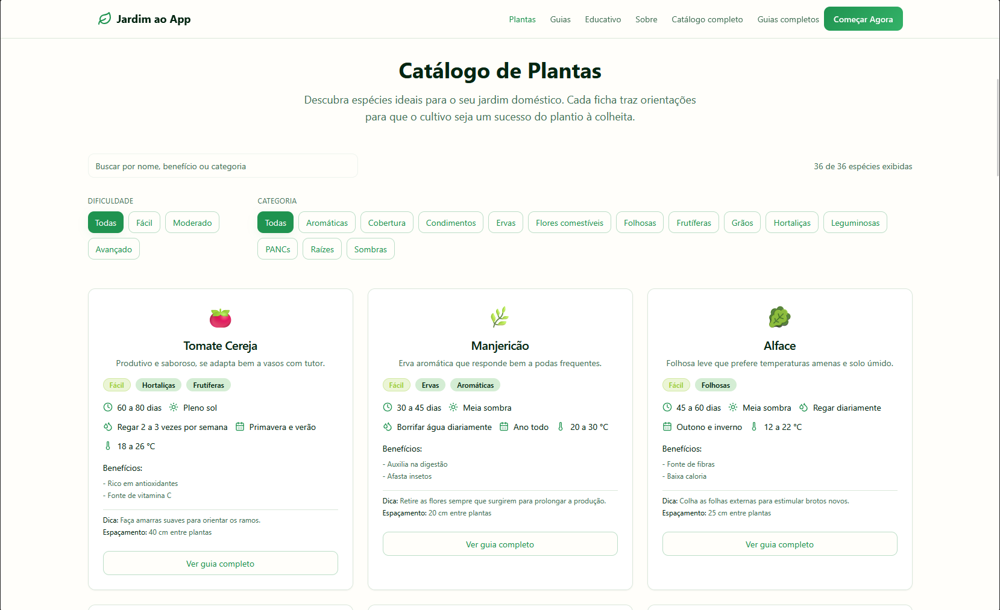
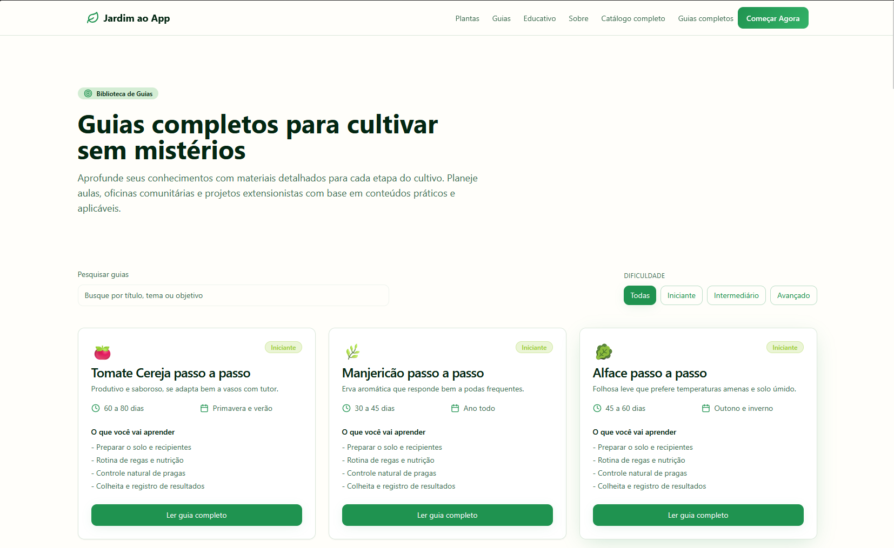

# Jardim ao App

## Sobre o projeto

Jardim ao App nasceu dentro do projeto extensionista do curso de Analise e Desenvolvimento de Sistemas da UNINTER. A ideia e levar horticultura urbana para escolas, comunidades e quem quiser montar uma horta no quintal, conectando dados coletados em campo a materiais digitais. A landing apresenta o programa, mostra estatisticas reais do catalogo e guia quem chega ate os materiais praticos.

## Tecnologias e escolhas

-  +  **React + Vite** para ganhar velocidade de desenvolvimento sem carregar dependencia desnecessaria.
-  **TypeScript** garantindo previsibilidade quando o projeto roda em laboratorio ou na apresentacao.
-  +  **Tailwind e shadcn/ui** permitem montar layout consistente com a paleta inspirada nas hortas comunitarias.
-  +  **React Router + React Query** organizam as rotas e o fluxo de dados compartilhado entre catalogo, guias e landing.

## Como rodar por aqui

1. `git clone https://github.com/Luanvictordev/Jardim-Ao-APP.git`
2. `cd Jardim-Ao-APP`
3. `npm install` para baixar as dependencias.
4. `npm run dev` e acesse `http://localhost:5173`.
5. `npm run build && npm run preview` caso queira validar o bundle antes de subir no GitHub Pages.
6. `npm run lint` para garantir que o padrao de estilo continua limpo.

## O que voce encontra na interface

_Filtros rapidos, contagem real de especies e cards com dicas que usamos nas oficinas._

_Biblioteca completa com duracao, estacao ideal e topicos principais de cada trilha._

## Obrigado por passar por aqui

Esse projeto existe porque muita gente compartilhou historias de quintal, hortas comunitarias, feiras locais e salas de aula. Se tiver feedback, relato ou quiser adaptar para a sua comunidade, abre uma issue ou manda mensagem. Vamos seguir cultivando - online e offline.
