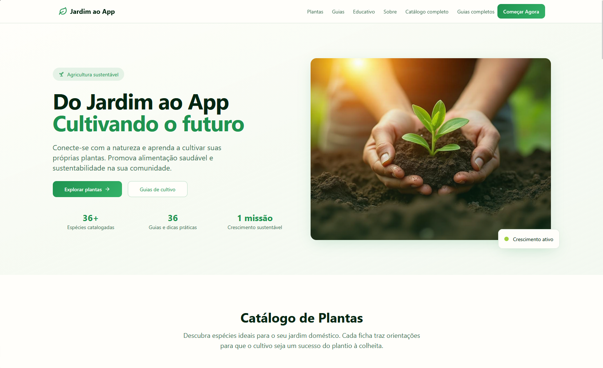
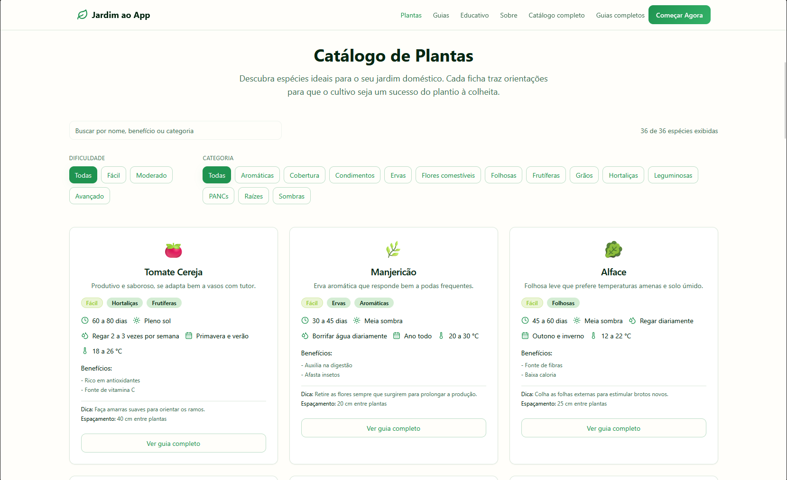
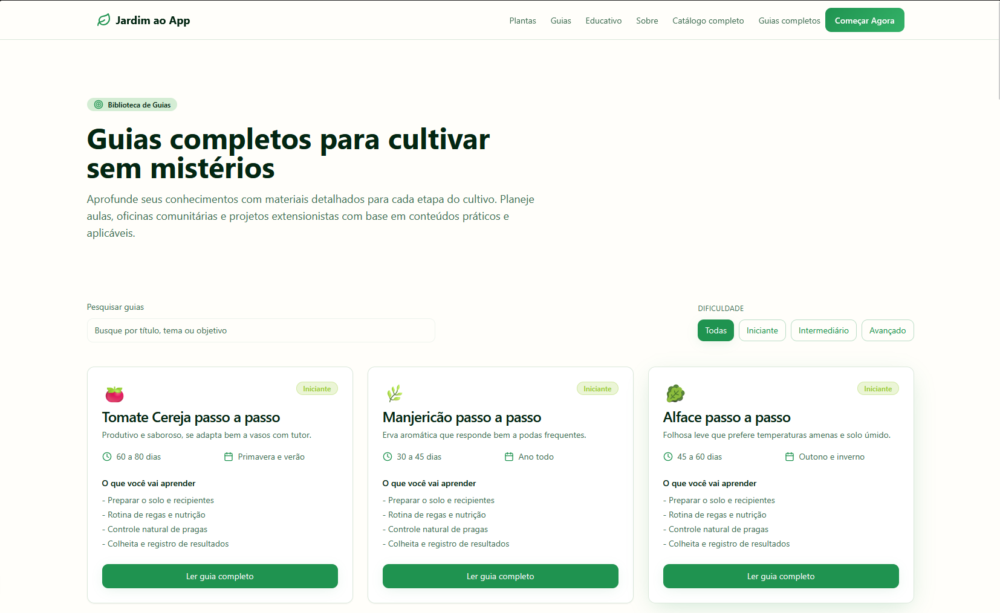

# Jardim ao App

Landing e catalogo do projeto Jardim ao App, juntando guias de cultivo e dados extensionistas para agricultura urbana.

## Por que essas escolhas?

- **React + Vite**: escolha leve para prototipar rapido e acessivel para quem quiser contribuir depois.
- **TypeScript**: ajuda a manter o codigo previsivel na hora da apresentacao e durante as revisoes.
- **Tailwind CSS e shadcn/ui**: aceleram o visual sem perder a identidade que criamos a partir das hortas comunitarias.
- **React Query e React Router**: organizam as rotas e deixam o fluxo de dados tranquilo entre landing, catalogo e guias completos.

## Como rodar

```bash
npm install
npm run dev
npm run lint
```

## Como esta o projeto em tela


_Tela inicial com o resumo do projeto, estatisticas principais e chamadas para o catalogo e os guias._


_CatalogoDePlantas.png destaca os filtros, contagem de especies e o card interativo de exemplo._


_O print GuiasCompletos.png mostra a biblioteca de materiais com filtros e descricoes das trilhas._

## Agradecimento

Esse trabalho so existe porque muita gente compartilhou historias de quintal, hortas comunitarias e salas de aula. Se tiver sugestoes, relatos ou quiser reaproveitar o conteudo, abre uma issue ou manda mensagem. Vamos seguir cultivando, online e offline.

